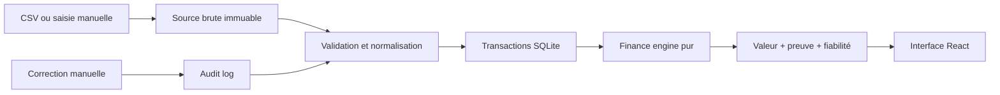

# Architecture technique

## Décision desktop

La V1 utilise **Tauri 2 + React + TypeScript + SQLite**.

| Critère | Tauri | Electron |
| --- | --- | --- |
| Runtime | WebView2 du système | Chromium + Node embarqués |
| Taille installée | Généralement plus faible | Généralement plus élevée |
| Mémoire | Plus sobre | Plus coûteuse |
| Accès natif | Rust et plugins à permissions | Node et processus principal |
| Maturité web | Bonne | Excellente |
| Choix Ostiro | **Retenu** | Repli si un connecteur Node l'impose |

Tauri convient à une application locale durable, légère et distribuée comme installateur Windows. Le frontend reste portable : une future version web pourra réutiliser React et le moteur TypeScript sans imposer un serveur à l'application desktop.

## Monorepo

```text
apps/desktop/
  src/                 Interface React et accès au stockage
  src-tauri/           Coque native, permissions et installeurs
packages/shared/       TracedValue, provenance, audit, fiabilité
packages/finance-engine/ Calculs financiers purs
packages/database/     Schéma, migrations et manifeste de sauvegarde
packages/importers/    Parsing, mapping, validation et doublons CSV
examples/              Données fictives sans information personnelle
docs/                  Documentation produit et technique
```

## Flux de données



Les valeurs importées brutes ne sont jamais mises à jour. Une correction enregistre ancienne valeur, nouvelle valeur, auteur local, date, raison et métriques touchées. Les snapshots sont des caches explicables; ils peuvent être supprimés et recalculés.

## Frontières

- **Interface** : présentation et interactions, aucune formule financière métier.
- **Finance engine** : fonctions déterministes sans accès réseau, base ou horloge implicite.
- **Database** : persistance locale et migrations, aucune vérité dérivée non traçable.
- **Importers** : lecture locale, aperçu et validation avant écriture.
- **Tauri** : système de fichiers, SQLite, fenêtres et futures notifications.

## Évolution serveur

Une version self-hosted avancée pourra remplacer l'adaptateur SQLite par PostgreSQL. Elle devra conserver les mêmes contrats `TracedValue`, les sources immuables et le moteur de calcul. Redis, files de jobs et cloud ne sont pas requis par la V1 desktop.
